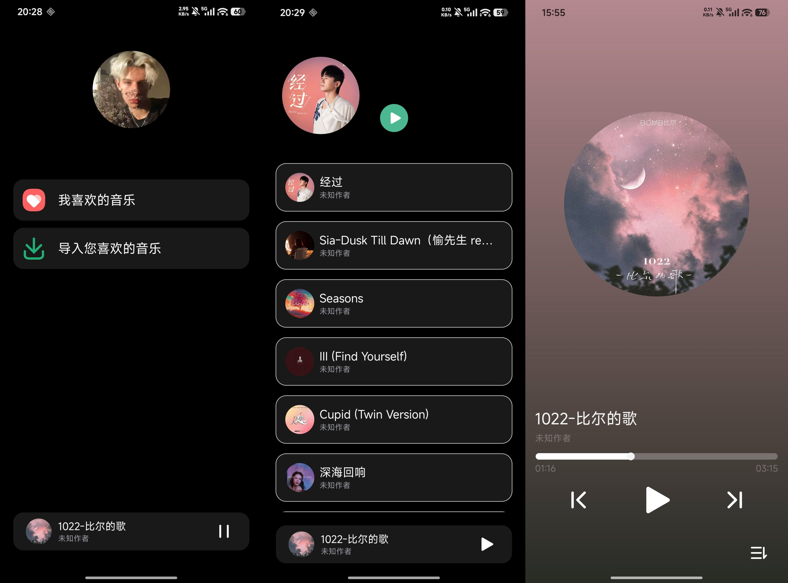

## 该项目是使用原声 Android 开发的一款专注于听歌的本地音乐播放器

项目使用 `Service` + `BroadCast` + `MediaPlayer` 实现实现了最核心的音乐播放功能。

通过 `MediaSession` 加前台服务实现音乐的前台通知播放、前台播放控制等服务。

在音乐播放页面，使用 `KMeans` 算法实现根据音乐封面生成基于封面的主、次色。再通过第三方库 `palette` 将主、次色应用到音乐播放的背景。

下面是项目的图片展示：

